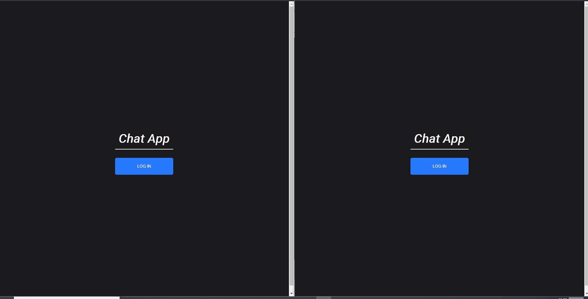

# Serverless Project

Endpoint Websocket URL: wss://jyvmqrh1c5.execute-api.eu-west-2.amazonaws.com/dev

Frontend URL: https://serverless-capstone-samadarshad.netlify.app/

View the frontend to interact with the application. You can use any fake email and password when signing up i.e. george@email.com.

## Description


This is a serverless chat application, which uses websockets for real time chat. The backend is all websockets api (there is no HTTP api).
There are 4 websocket endpoints:
- $connect: this requires connecting with the user's JWT access token (excluding 'Bearer ') i.e. `wss://jyvmqrh1c5.execute-api.eu-west-2.amazonaws.com/dev?token={accessToken}`. It will return a http response code.
- onJoin: to join a chat room. See required JSON properties in `src/requests/onJoinRequest.ts`. Returns http code.
- onMessage: to send a message. See required JSON properties in `src/requests/onMessageAction.ts`. Returns http code.
- $disconnect

The outgoing messages from the websocket are:
- message broadcasts from the room the connected user is currently in. See JSON format `src/responses/sendMessageResponse.ts`
- http response codes. see `src/responses/errorResponse.ts`

## Architecture


$Connect saves a new connection along with authorization details, $disconnect deletes it.
OnJoin takes in a room join request and saves it with the connection.
OnMessage takes in a message, checks if the connection is authorized to perform action (i.e. for update/delete message), then posts it to an internal SNS.
This SNS then distributes the message to subscribers: 
- 1: broadcasting the message to the room
- 2: saving the message to a messages DB for later retrieval (this is not implemented)

Alternate architectures could be:
- instead of a SNS, the OnMessage handler could perform the broadcast in a single lambda function. This would be optimised, but coupled, which was not ideal for the architecture expansion of storing messages in a DB.
- instead of querying the connections database for the authorization details, the client can send the authorization details in a JWT token. This would save a query (i.e. latency), but would mean the user has to send a larger payload.

## Development
Prerequisites
- Node v14
- Java JDK/JRE (for running dynamodb locally):

```
sudo apt update

sudo apt install default-jre

sudo apt install default-jdk

npm install serverless-dynamodb-local@0.2.30 --save-dev

npm install serverless-offline --save-dev

sls dynamodb install
```

- AWS Account, with an IAM role for profile `serverless` with `AdministratorAccess` policy attached
- `npm i -g serverless`
- `sls config credentials --provider aws --key YOUR_ACCESS_KEY --secret YOUR_SECRET_KEY --profile serverless`

### How to run the frontend locally
Frontend code and instructions here: https://github.com/samadarshad/serverless-capstone-client

### How to run the backend locally

0. If not done already, generate websocket validation Json Schemas by running:

`npm i -g typescript-json-schema`

`npm run generate`

1. `npm i`

2. `sls run dev`

Websockets endpoint is ws://localhost:3001

Dynamodb can be viewed at localhost:8000/shell

### Deploying Backend to AWS

`npm i`

`sls deploy -v` or `sls deploy -v --aws-profile serverless`

Endpoint is given in console. 

### Improvements
- Messages are currently not stored in a database, which means that users cannot retrieve a history of messages upon joining a chatroom. Part of the infrastructure is already set up for this, but it needs a messages dynamodb, and a websockets endpoint to fetch messages for a room.
- Lambda functions can be optimised for size, requires longer compilation time.
- XRay Tracing NodeJS SDK is currently not supported for websockets
- Caching on DB to reduce load as every message requires a query for userId